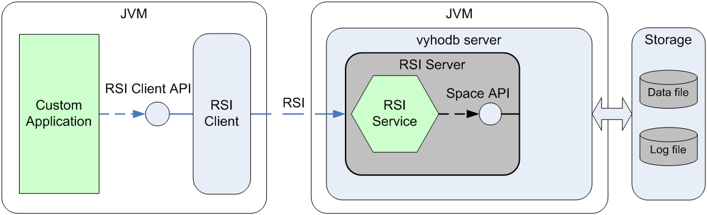
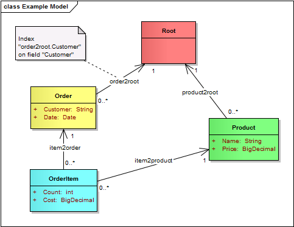

# Introduction

This article gives brief introduction into vyhodb. 

For practicing with vyhodb API use [Getting Started](/docs/vyhodb_getting_started.en.pdf) document.

For getting more information about vyhodb API use [Developer's Guide](/docs/vyhodb_dev_guide.en.pdf).

For Function API details use [Functions API Reference](/docs/vyhodb_functions_reference.en.pdf).

For vyhodb administration and configuring see [Administrator's Guide](/docs/vyhodb_admin_guide.en.pdf).

## Network model

Enterprise grade applications are usually dialing with complex domain model and sophisticated business logic. 
Of course we can model almost everything in relation model, but it isn’t nature for relation model to 
dial with hierarchies, variable set of fields and relations, so we always have to align our 
domain model to relation model. Some projects even create their own frameworks for treating relation 
databases as network ones.

So, what are the basic concepts of vyhodb network model? There are five of them:

  - **Space** - container of records (storage). Is used to create new records and retrieve record by its id.
  - **Record** – main concept, it is used to model some entity from real world. Similar to table’s row in database concept. Has unique identifier (long type) and contains fields.
  - **Field** – named value which is stored inside record.
  - **Link** – connect two records by child->parent link.
  - **Indexes** – used for indexing children records of particular parent records to speed up searching.

Let’s have a look at example. Picture below shows three records, connect by named links:


vyhodb network model is schemaless, which means that application creates records, 
connect them by links of any name, set fields of different names and different types. 
vyhodb doesn’t have rules which could restrict your application model. 

Space API provides Java API for reading and modifying vyhodb data. Just a little code example, 
to illustrate how simple it is:

```java
    Space space = …

    Record root = space.getRecord(0L);                  // Retrieves record by id
        
    Record order1 = space.newRecord();                  // Creates new record
    order1.setField("Customer", "Some Customer 2");     // Sets field
    order1.setParent("order2root", root);               // Creates link to root record
        
    Record order2 = space.newRecord();           
    order2.setField("Customer", "Other Customer 3");   
    order2.setParent("order2root", root);
    order2.setParent("relatedOrder", order1);
        
    // Iterates over child records
    for (Record order : root.getChildren("order2root")) {
        System.out.println(order);
    }
```

So to sum up, vyhodb's network model is great, because:

  * It models domain model in natural way
  * It is simple to dial with using Space API
  
## ACID transactions

We’ve seen a raise of no-SQL databases which have pretty cool options, like linear scaling 
to thousands of nodes, large throughput, etc. But almost all of them refuse 
**ACID** (Atomicity, Consistency, Isolation, Durability) properties.

Does ACID really matter for enterprise application? Yes! It is crucial for business logic 
to keep data in consistent state whatever happens with system. And this is how vyhodb works. 
It supports ACID transactions and transaction recovery in case of system crash.

Transaction isolation is other major factor. Vyhodb supports **SERIALIZABLE** isolation level 
between transactions: each transaction runs independently. It means that you can write code 
without worry about how other running transactions can affect the current one (read phenomena).

For performance reasons, vyhodb implements two transaction types: Read and Modify. 
So custom application explicitly specifies which transaction is required.

Let’s have a look at example below. Here we start vyhodb server in so called embedded mode 
(see further), open modify transaction and change data:

```java
  String LOG = "vdb/storage/vyhodb.log";
  String DATA = "vdb/storage/vyhodb.log";
        
  Properties props = new Properties();                // Configures vyhodb storage
  props.setProperty("storage.log", LOG);
  props.setProperty("storage.data", DATA);

  Server server = Server.start(props);                // Starts vyhodb in embedded mode
    
  TrxSpace space = server.startModifyTrx();           // Opens Modify transaction
  Record record = space.getRecord(0L);                
  record.setField("Description", "ACID matters!");
  space.commit();                                     // Commits transaction
    
  server.close();                                     // Shutdowns vyhodb
```

So, vyhodb:

  * Supports ACID transactions
  * Provides SERIALIZABLE isolation which prevents read phenomena and simplifies application logic
  * Splits transaction into Read and Modify types for the sake of performance and lock optimization
  
## Data Access and running modes

Now I am going to explain how your application can interact with vyhodb. Well, there are two running modes with 
different interaction models:

  - Embedded
  - Standalone

### Embedded mode
  
In embedded mode, your application starts vyhodb server in the same JVM, as shown on picture below:


We’ve seen example of how to start vyhdb in embedded mode in previous section. This is 
straightforward way to interact with vyhodb, but it isn’t convenient when many machines with your 
applications need access to vyhodb.

### Standalone mode

Standalone mode is more common. In this mode, vyhodb server is running in its own JVM. It hosts so 
called RSI Services (RSI – remote service invocation), which have access to vyhodb by Space API. 
Your application connects to vyhodb server and invokes methods of RSI Services. RSI Services can be 
considered as stored procedures written on Java. Picture below illustrate it:



## RSI

Developing RSI Service is easy. Just do the following steps:

  - Define service contract (Java interface) and add required annotations. Annotations define service implementation class and transaction types, which are opened by vyhodb during method invocation.
  - Create service implementation class.
  - Pack all classes into jar archive.
  - Deploy jar archive on vyhodb server (place it into **services** directory and restart vyhodb server).
  
Let’s have a look at code. Service contract:

```java
package com.vyhodb.intro;

import java.util.Collection;
import com.vyhodb.rsi.Implementation;
import com.vyhodb.rsi.Modify;
import com.vyhodb.rsi.Read;

@Implementation(className="com.vyhodb.intro.ServiceImpl")
public interface Service {

    @Modify
    public long newOrder(String customerName);
    
    @Read
    public Collection<String> listCustomers();
}
```

Service implementation class

```java
package com.vyhodb.intro;

import java.util.ArrayList;
import java.util.Collection;
import com.vyhodb.space.Record;
import com.vyhodb.space.ServiceLifecycle;
import com.vyhodb.space.Space;

public class ServiceImpl implements Service, ServiceLifecycle {

    private Space _space;
    
    @Override
    public void setSpace(Space space) {
        _space = space;
    }

    @Override
    public long newOrder(String customerName) {
        Record root = _space.getRecord(0L);
        
        Record order = _space.newRecord();
        order.setField("Customer", customerName);
        order.setParent("order2root", root);
        
        return order.getId();
    }

    @Override
    public Collection<String> listCustomers() {
        ArrayList<String> result = new ArrayList<>();
        
        Record root = _space.getRecord(0L);
        for (Record order : root.getChildren("order2root")) {
            String customerName = order.getField("Customer"); 
            result.add(customerName); 
        }
        
        return result;
    }
}
```

And finally, client side code. It establishes connection to vyhodb and invokes service methods:

```java
package com.vyhodb.intro;

import com.vyhodb.rsi.Connection;
import com.vyhodb.rsi.ConnectionFactory;
    . . .
    String URL = "tcp://localhost:47777";
        
    try(Connection connection = ConnectionFactory.newConnection(URL)) {
            
        Service service = connection.getService(Service.class);
            
        service.newOrder("Customer 3");
        service.newOrder("Customer 1");
        service.newOrder("Customer 2");
           
        Collection<String> customers = service.listCustomers();
        System.out.println(customers);
    }
```

That’s all.

So, what are the benefits of using RSI and standalone mode? A lot of them:

  * You separate your business logic (in a form of RSI Services) and put it close to data.
  * One transaction per one method invocation. No network interactions during transaction. 
  * Very simple RSI mechanism: no code generation, no schema, no xsd/xml, no service repositories.
  
## Functions API

Functions API is a library and approach which allows simple way for traversing over graph of records. 

It’s better to illustrate by example. We are going to implement code for printing OrderItem records 
which refer to the Product record with specified name. Firstly, we'll show how to do it using for-each 
cycles and after that how to solve the same task by using Functions API.

Examples are based on the following data model:



Using **for-each** cycles:

```java
        String productName = "Product 2";
        Record root = space.getRecord(0L);
                
        for (Record product : root.getChildren("product2root")) {
            if (productName.equals(product.getField("Name"))) {
                for (Record item : product.getChildren("item2product")) {
                    System.out.println(item);
                }
            }
        }
```

Using Functions API (pay attention to static import directives):

```java
import static com.vyhodb.f.CommonFactory.*;
import static com.vyhodb.f.NavigationFactory.*;
import static com.vyhodb.f.PredicateFactory.*;        
. . .

        String productName = "Product 2";        
        Record root = space.getRecord(0L);
                
        // Builds function
        F printf = 
        childrenIf("product2root", fieldsEqual("Name", productName),
            children("item2product", 
                printCurrent()
            )
        );
   
        // Evaluates function
        printf.eval(root);
```

It looks more elegant, intuitive and simple, isn’t it?

Main idea behind Functions API is that your application creates function (graph of function’s objects),
 using static methods, and afterwards evaluate it. Code looks like program on function language (like LISP).
 
Functions API can be used in many situations: traversing records with filtering, printing graph of traversed records, modifying records, 
calculating aggregate values (sum, min, max, …) and even creating Java object graph from records (see next section).

All functions support serialization, so you can create function on client side and send it to RSI Service 
for evaluation. However this approach has security issues.

## ONM API

Space API with its records, field and links is good for using, but it would be better to read/write graph of 
java objects from/to vyhodb storage.

ONM (**O**bject to **N**etwork model **M**apping) API is intended for this.

In a nutshell it does:

  * [ONM reading](#onm-reading) traverses over records and for each visited record create appropriate java objects and set references between objects. Traversing route is specified by functions (using Functions API).
  * [ONM writing](#onm-writing) traverses all objects in java object graph and updates corresponding records (creates new/changes/deletes).
  
Code example is better than thousands of words. At first, we define domain classes with annotations
 (import directives, setters and getters are omitted to keep examples short). Annotations specify fields and 
 link mappings. Domain classes are based on data model, shown in previous section.
 
Order class:

```java
@Record
public class Order {
    
    @Id
    private long id;
    
    @Field(fieldName="Customer")
    private String customer;
    
    @Field(fieldName="Date")
    private Date date;
    
    @Children(linkName="item2order")
    private Collection<Item> items;
    . . .
}
```

Item class:

```java
@Record
public class Item {

    @Id
    private long id = -1;
    
    @Field(fieldName="Cost")
    private BigDecimal cost;
    
    @Parent(linkName="item2order")
    private Order order;
    
    @Parent(linkName="item2product")
    private Product product;
    . . .    
}
```

Product class:

```java
@Record
public class Product {

    @Id
    private long id = -1;
    
    @Field(fieldName="Name")
    private String name;
    . . .
}
```

Now we are going to read object graph. 

### ONM Reading

Code below creates ONM function, which traverses from record considered as **Order**
 (passed to evaluation) to the **Item** records and further to related **Product** records.
 
For each visited record ONM function creates appropriate java object, fills its fields, 
sets references to parent objects or adds child objects into collections:

```java
import static com.vyhodb.f.NavigationFactory.*;
import static com.vyhodb.onm.OnmFactory.*;
. . .
        // Creates mapping information cache
        Mapping mapping = Mapping.newAnnotationMapping();
        
        // Creates read function
        F onmReadF = 
        startRead(Order.class, mapping,
            children("item2order",
                parent("item2product")
            )
        );
        
        // Retrieves record which correspond to Order
        Record orderRecord = getOrderRecord();
        
        // Evaluates function. It traverses over records and creates 
        // Order object with Item and Product objects
        Order order = (Order) onmReadF.eval(orderRecord);
```
Note, that ONM Reading creates object graph, not an object tree.

ONM neither generate auxiliary classes nor use code generation.  It facilitates java reflection. 
ONM Reading creates the whole java object graph during function evaluation. No lazy loading.

Because vyhodb is schemaless database, records don’t have types. Particular record can be used 
for instantiate objects of different classes, depending on traversal route and root object's class. 
So you can have many class models for the same record graph.

### ONM Writing

ONM Writing is pretty simple (**com.vyhodb.onm.Writer** class is used). Method **Writer#write()** traverses over 
all java objects in passed graph and updates corresponding records in passed Space.

```java
        Space space = getSpace();
        Mapping mapping = Mapping.newAnnotationMapping();
        
        Order order = buildObjects();
                
        Writer.write(mapping, order, space);
```

Benefits of using ONM API:

  * Simple and flexible
  * Eager read; no lazy loading
  * No actions behind the scene: reading/writing is fully controlled by application
  * No code/class generation: read objects are ordinary java objects
  * Reads object graph, not a tree
  
## Administration

vyhodb configuring and administration are really easy. There is only one configuration file and 
two storage files: data file (contains all data) and log file (transaction journal file). 
Both storage files are growing automatically so you don’t have to worry about things like extending 
table space etc.

Administration tasks (like new storage creation, hot backup, restoration, 
log file truncating, etc) are performed by command line utilities.

As a production ready system, vyhodb supports the following features:

  * Hot backups
  * Master - Slave replication
  * RSI balancer cluster (redistributes RSI invocation among many vyhodb servers)
  